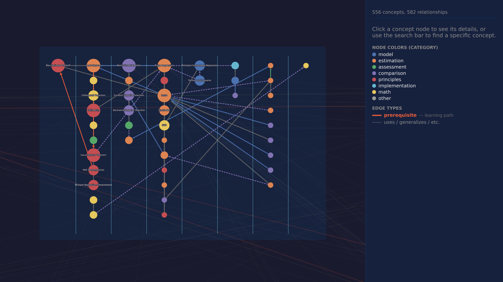
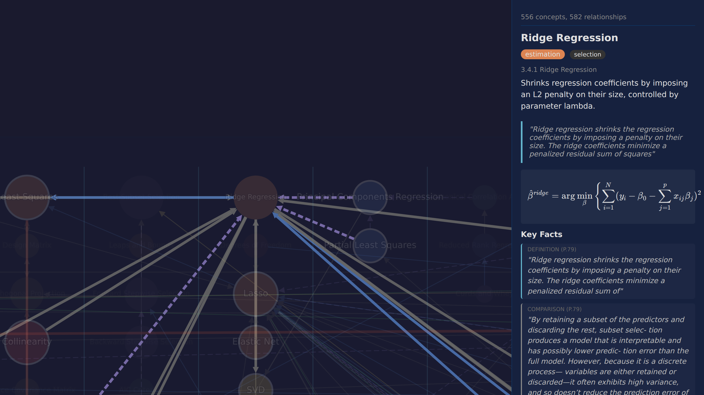
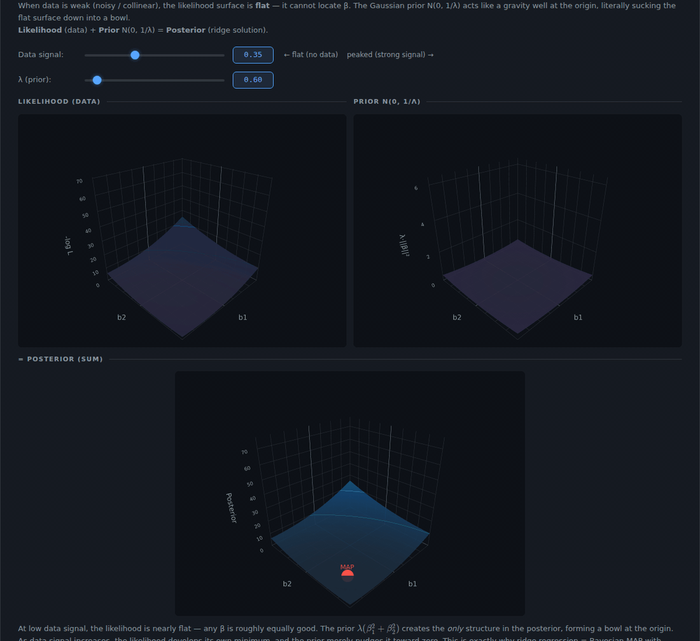
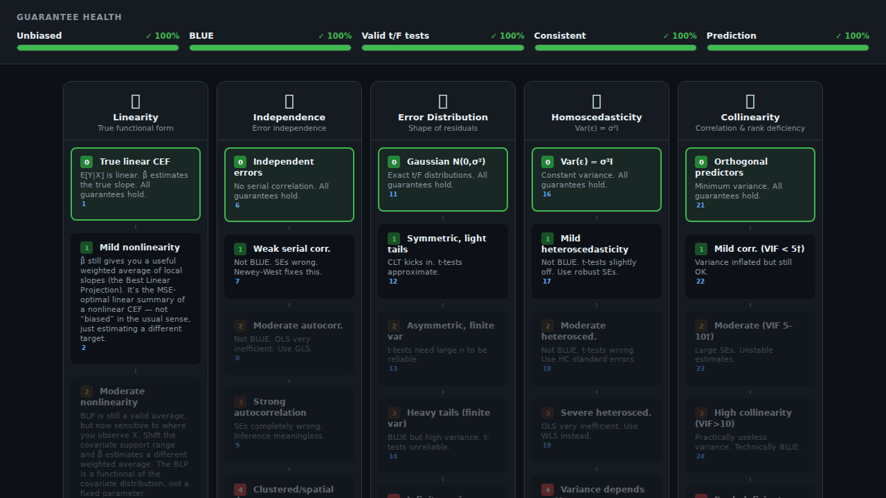

# textparse

Algorithmically dissect math/stats textbooks into a relational knowledge graph,
then build interactive visualizations, assumption explorers, and Anki cards on
top of it. ESL (*The Elements of Statistical Learning*) is the test case;
the system is meant to generalize to any technical textbook.

## What's in here

### Knowledge graph

A typed dependency graph of every concept in the book, plus a parent-child
chapter/section tree. Click any node to see its definition, prerequisites,
and a button straight into its visualization.

| Chapter 3 cluster | Ridge Regression and its neighborhood |
|---|---|
|  |  |

### Concept visualizations

One self-contained interactive page per concept. Pages lead with **benefits &
tradeoffs** (with textbook citations), then build intuition through visuals,
then state the formal guarantees, then dump the formulas as reference. The
formulas come last on purpose.

Below: the Bayesian view of ridge regression. First the data signal slider
sharpens the likelihood; then the λ slider deepens the prior bowl, pulling
the posterior toward the origin.



### Assumption explorers

For each major model (currently linear regression), every assumption is a
column with tiers from "textbook-perfect" down to "broken." Click a tier and
the status panel shows which guarantees still hold, which break, and which
fix applies — every claim cited.



## Architecture

| Module | Path | What it does |
|---|---|---|
| PDF parser | `src/pdf_parser/` | Pulls text, fonts, and spatial layout from PDFs (PyMuPDF + pdfplumber for tables). |
| Database | `src/database/` | SQLAlchemy/SQLite models for textbooks, pages, paragraphs, concepts, and typed edges. |
| Visualization | `src/visualization/` | Static images, manim animations, interactive HTML/JS pages. |
| Output | `output/` | Generated knowledge graph, concept-viz pages, assumption explorers. |
| Data | `data/` | SQLite database and source PDFs. |

Concept extraction is hybrid: font + regex heuristics first, LLM for ambiguous
paragraphs and relationship inference.

## Stack

Python · SQLAlchemy/SQLite · PyMuPDF · pdfplumber · manim · matplotlib ·
Plotly.js · Cytoscape.js

## Running it

```bash
pip install -r requirements.txt
python main.py                # parse + populate DB
python extract_concepts.py    # heuristics + LLM concept pass
```

Generated pages live under `output/`. Open any `.html` directly in a browser —
no server needed.

## Project management

Issues are tracked in Linear. Use `scripts/linear.sh` (the Linear MCP server
hangs in WSL2). See `CLAUDE.md` for the agent system, pedagogy rules, and
project philosophy.
